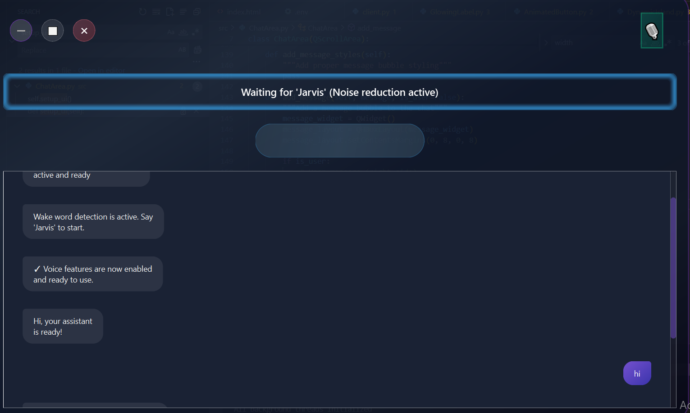

# 🤖 AI Assistant

A modern AI assistant featuring voice control, code generation.
Built with Python and PyQt6, providing a seamless and intuitive interface for AI-powered tasks.

## 📸 Demo



_AI Assistant in action - showcasing the modern interface and real-time AI interaction_

### ✨ Key Features Demonstrated:

-   🎤 **Voice Interaction**: Natural conversation with wake word activation
-   🤖 **AI Processing**: Real-time responses powered by Gemini AI
-   💻 **Smart Interface**: Clean, modern UI with intuitive controls
-   ⚡ **Quick Actions**: Efficient command processing and execution

### Key Features

| Category      | Features                                                                 |
| ------------- | ------------------------------------------------------------------------ |
| 🎤 **Voice**  | Wake word detection, Speech recognition, Text-to-speech, Noise reduction |
| 💻 **Code**   | Smart completion, Syntax highlighting, Editor integration                |
| ⚙️ **Config** | API setup, Voice settings, UI preferences, Storage                       |
| 🔗 **Apps**   | Custom commands, App launching, Command sequences                        |

### 🎤 Voice Control

-   **Wake Word Detection**: Activate with "computer" using Picovoice Porcupine
-   **Speech Recognition**: Accurate voice-to-text with noise reduction
-   **Text-to-Speech**: Natural voice responses with multiple voice options
-   **Noise Reduction**: WebRTC-based voice activity detection

### 💻 Code Generation

-   **Smart Completion**: Context-aware code suggestions
-   **Syntax Highlighting**: Clear code visualization
-   **Editor Integration**: Custom editor configuration
-   **Code Simulation**: Typing simulation for demonstrations

### ⚙️ Settings Management

-   **API Configuration**: Gemini and Picovoice API key management

### 🔗 App Integration

-   **Custom Commands**: User-defined command sequences
-   **App Launching**: Quick access to favorite applications
-   **Command Sequences**: Multi-step automation
-   **Settings Persistence**: Saved configurations across sessions

### Installation

1. Create and activate virtual environment:

```bash
# Windows
python -m venv venv
venv\Scripts\activate

# Linux/Mac
python3 -m venv venv
source venv/bin/activate
```

2. Install dependencies:

```bash
pip install -r requirements.txt
```

3. Configure API Keys:
    - Launch the application
    - Navigate to Settings
    - Add required API keys:
    - Gemini API key (AI features)
    - Porcupine key (wake word)

## 🎯 Usage Guide

### 🎤 Voice Commands

-   Activate: Say "Jarvis"
-   Speak your command/question
-   Receive voice and text response

### 💻 Code Generation

1. Describe your code needs
2. Get formatted, syntax-highlighted code
3. Copy or save generated code

## 🛠️ Development

### Requirements

Check `requirements.txt` for full dependency list:

-   PyQt6 >= 6.4.2
-   google-generativeai >= 0.3.0
-   SpeechRecognition >= 3.10.0
-   And more...

### Project Structure

```
ai-assistant/
├── AI_Assistant.py    # Main application
├── requirements.txt   # Dependencies
├── README.md         # Documentation
├── LICENSE          # MIT License
└── .gitignore       # Git ignore rules
```

## Acknowledgments

-   Google Gemini - AI capabilities
-   PyQt6 - UI framework
-   Picovoice - Wake word detection

## 🤖 Automation

### Features

-   Custom Script Creation
-   Event-Based Triggers
-   App Integration
-   Voice Command Macros

## 📥 Installation Guide

### Prerequisites

-   Python 3.8 or higher
-   Git
-   Microphone (for voice features)
-   Camera (optional, for image analysis)

## 🚀 Usage

### Starting the Assistant

```bash
python main.py
```

### Voice Commands

-   Say "Jarvis" to activate
-   Wait for the activation sound
-   Speak your command
-   Examples:
    -   "What's the weather like?"
    -   "Generate some Python code"
    -   "Analyze this image"

### Camera Features

-   Click the camera icon to start
-   Use "Analyze" for real-time analysis
-   Upload images for detailed analysis

### Code Generation

-   Request code in natural language
-   Use the code editor for modifications
-   Save generated code to files
